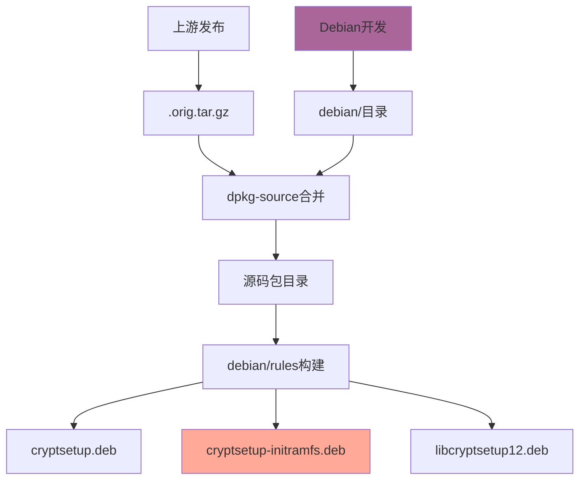

# Debian包管理与文件层级系统深度分析

> 基于cryptsetup项目的实际案例研究 - 理解开源生态的协作模式
> 
> 日期：2024年12月20日

## 目录

1. [核心发现](#核心发现)
2. [Debian三层文件结构](#debian三层文件结构)
3. [文件层级管理机制](#文件层级管理机制)
4. [版本管理与变更跟踪](#版本管理与变更跟踪)
5. [分层协作模式](#分层协作模式)
6. [对比其他管理方式](#对比其他管理方式)
7. [开源生态启发](#开源生态启发)

---

## 核心发现

### 重要洞察 💡

通过深入分析Debian的cryptsetup包管理，我们发现了一个重要真相：

**❌ 常见误解**: Debian是"复制Red Hat代码然后修改"
**✅ 实际情况**: Debian**完全独立创造**了initramfs集成层

### 数据证据

```bash
# 上游原始文件 (Red Hat/Milan Broz)
$ tar -tzf cryptsetup_2.7.5.orig.tar.gz | grep -i initramfs
(输出：0个文件)

# Debian增强层 (Debian团队创造)
$ tar -tJf cryptsetup_2.7.5-2.debian.tar.xz | grep initramfs | wc -l
输出：33个文件

# 包括完整的initramfs生态系统：
- hooks/cryptroot-unlock (智能检测脚本)
- scripts/local-top/cryptroot (启动脚本)
- conf-hooks.d/cryptsetup (配置管理)
```

### 设计哲学

**不是"下游修改上游"，而是"分层协作创新"**

---

## Debian三层文件结构

### 源码包组成

每个Debian源码包由**三个文件**组成：

```bash
cryptsetup_2.7.5.orig.tar.gz    # 上游原始代码
cryptsetup_2.7.5-2.debian.tar.xz # Debian增强层  
cryptsetup_2.7.5-2.dsc           # 元数据描述
```

### 文件内容分析

| 文件 | 来源 | 内容 | 文件数量 |
|------|------|------|----------|
| `.orig.tar.gz` | Red Hat上游 | 核心cryptsetup工具 | ~200个文件 |
| `.debian.tar.xz` | **Debian团队** | **系统集成层** | ~100个文件 |
| `.dsc` | Debian | 构建元数据 | 1个文件 |

### 关键发现：实际文件 vs 索引

**重要**：`.debian.tar.xz` 包含的是**完整的实际文件**，不是索引或引用！

```bash
# 例证：cryptroot-unlock完整脚本
$ tar -xJf cryptsetup_2.7.5-2.debian.tar.xz debian/initramfs/hooks/cryptroot-unlock
$ wc -l debian/initramfs/hooks/cryptroot-unlock
47 debian/initramfs/hooks/cryptroot-unlock

# 这是Debian团队完全独立编写的47行bash脚本！
```

---

## 文件层级管理机制

### .install文件 = 路径映射表

Debian使用`.install`文件定义"源文件→目标路径"的映射关系：

```bash
# cryptsetup-initramfs.install
debian/initramfs/hooks/*                     → /usr/share/initramfs-tools/hooks/
debian/initramfs/cryptroot-unlock            → /usr/share/cryptsetup/initramfs/bin/
debian/initramfs/scripts/local-top/cryptroot → /usr/share/initramfs-tools/scripts/local-top/

# cryptsetup.install  
src/cryptsetup                               → /usr/sbin/cryptsetup
lib/libcryptsetup.so.*                       → /usr/lib/
```

### 分包策略

通过不同的`.install`文件，Debian将一个源码包分解为多个二进制包：

| 二进制包 | 文件来源 | 主要内容 | 用户群体 |
|----------|----------|----------|----------|
| `cryptsetup` | 90%上游 + 10%Debian | 核心工具 | 所有用户 |
| `cryptsetup-initramfs` | **100%Debian创造** | initramfs集成 | 启动加密用户 |
| `libcryptsetup12` | 100%上游 | 共享库 | 开发者 |
| `cryptsetup-ssh` | 100%Debian | SSH集成 | 远程管理员 |

### 构建流程



---

## 版本管理与变更跟踪

### 自动上游跟踪

**debian/watch文件**：
```bash
version=4
options="mode=git,pgpmode=gittag, \
         uversionmangle=s/-(alpha|beta|rc)(\d*)$/~$1$2/, \
         compression=gzip" \
  https://gitlab.com/cryptsetup/cryptsetup.git \
  refs/tags/v?@ANY_VERSION@
```

**工作机制**：
1. **自动监控**：Debian工具定期检查上游新发布
2. **版本获取**：自动下载新版本并生成`.orig.tar.gz`
3. **合并集成**：Debian维护者将自己的`debian/`目录与新版本合并
4. **测试发布**：经过测试后发布新的Debian包

### 详细变更记录

**debian/changelog示例**：
```
cryptsetup (2:2.7.5-2) unstable; urgency=medium

  [ Christoph Anton Mitterer ]
  * d/README.Debian: Minor improvements.
  * d/README.Debian: Document when during the initramfs devices are mapped.

  [ Stephen Gildea ]
  * initramfs hook: Improve the "Source mismatch" error message when
    /etc/crypttab gives a source device that does not match the current source.

  [ Guilhem Moulin ]
  * DEP-8: No longer mark cryptroot-* as flaky and only run them on amd64.
  * Fix d/t/initramfs-hook with initramfs-tools ≥0.146. (Closes: #1099818)

 -- Guilhem Moulin <guilhem@debian.org>  Wed, 29 May 2024 09:17:14 +0200
```

**记录维度**：
- ✅ **具体变更内容**：每个修改的详细描述
- ✅ **修改者身份**：明确的责任归属
- ✅ **时间戳**：精确的修改时间
- ✅ **Bug关联**：关联的Bug报告编号
- ✅ **发布信息**：版本号、紧急程度、目标发行版

### Git工作流程

**git-buildpackage配置 (debian/gbp.conf)**：
```ini
[DEFAULT]
debian-branch = debian/latest
upstream-branch = upstream/latest
compression = gzip
pristine-tar = False

[import-orig]
upstream-vcs-tag = v%(version)s
```

**分支策略**：
- `upstream/latest` - 跟踪上游发布
- `debian/latest` - Debian的集成工作
- 自动标签管理和版本同步

---

## 分层协作模式

### 职责清晰分离

| 层次 | 负责方 | 职责范围 | 关注重点 |
|------|--------|----------|----------|
| **核心工具层** | Red Hat/Milan Broz | cryptsetup核心功能 | 加密算法、跨平台兼容 |
| **系统集成层** | Debian团队 | initramfs集成 | 用户体验、启动流程 |
| **发行版适配层** | Debian团队 | 包管理、依赖关系 | 系统稳定性、安全更新 |

### 协作机制

**技术协作**：
```bash
# 1. 上游专注核心 (Red Hat)
gitlab.com/cryptsetup/cryptsetup
├── src/cryptsetup.c           # 核心加密工具
├── lib/libcryptsetup.c        # 加密库
└── docs/                      # 核心文档

# 2. Debian增加集成 (Debian团队)  
salsa.debian.org/cryptsetup-team/cryptsetup
├── debian/initramfs/          # 100%Debian创造
├── debian/scripts/            # 系统集成脚本
└── debian/tests/              # 集成测试
```

**沟通协作**：
- **反馈渠道**：Debian发现的问题可以反馈给上游
- **功能请求**：Debian的需求可能影响上游设计
- **安全协调**：安全漏洞的协调修复
- **标准制定**：共同参与相关标准的制定

### 价值创造

**上游价值** (Red Hat贡献)：
- ✅ 高质量的加密工具
- ✅ 跨平台兼容性
- ✅ 安全性和性能优化
- ✅ 长期维护和支持

**下游价值** (Debian贡献)：
- ✅ 无缝的系统集成
- ✅ 优秀的用户体验
- ✅ 完整的启动流程支持
- ✅ 详细的文档和测试

---

## 对比其他管理方式

### 不同的文件管理策略

| 管理方式 | 文件存储方式 | 变更跟踪 | 冲突解决 | 适用场景 |
|----------|--------------|----------|----------|----------|
| **Debian包管理** | 分层实际文件 | changelog+版本 | 人工合并 | 系统软件分发 |
| **Git Submodule** | 仓库引用 | Git提交哈希 | Git合并 | 代码库组合 |
| **Docker分层** | 文件系统差异 | 层哈希值 | 镜像重建 | 应用容器化 |
| **RPM打包** | 单一源码+patch | spec文件 | patch管理 | Red Hat生态 |
| **Overlay文件系统** | 透明覆盖 | 文件时间戳 | 上层优先 | 容器/虚拟化 |

### 优势对比

**Debian方式的优势**：
- ✅ **清晰职责**：上游vs下游职责明确
- ✅ **独立演进**：不受上游发布周期限制
- ✅ **质量控制**：每个变更都有详细记录
- ✅ **灵活集成**：可以为特定用户群体优化

**其他方式的特点**：
- **Git Submodule**：适合代码复用，但集成复杂
- **Docker分层**：适合应用分发，但不适合系统软件
- **RPM**：Red Hat的patch模式，修改相对集中

### 适用性分析

**Debian模式适合**：
- 需要深度系统集成的软件
- 有明确上游和下游分工的项目
- 需要长期维护和演进的系统组件

**其他模式适合**：
- 应用软件打包 (Docker)
- 临时性修改 (patch)
- 代码库组合 (Submodule)

---

## 开源生态启发

### 对ZFS改进项目的指导

**我们的发现验证了改进方向**：

1. **cryptsetup的成功模式**：
   - 上游(Red Hat)专注核心工具
   - Debian创造了优秀的initramfs集成
   - 用户获得完整的体验

2. **ZFS的现状**：
   - 上游(OpenZFS)包含基础initramfs支持
   - 但缺乏Debian级别的精细化集成
   - 用户体验不如cryptsetup

3. **我们的改进价值**：
   - **在ZFS上游层面添加Debian级别的集成质量**
   - 让所有发行版都能受益
   - 不需要每个发行版单独重新发明轮子

### 开源协作的最佳实践

**成功的分工模式**：
```
核心项目 (专注功能) + 发行版集成 (专注体验) = 完整用户价值
```

**关键要素**：
1. **明确的职责边界**：谁负责什么功能
2. **有效的沟通机制**：问题反馈和需求传递
3. **标准化的接口**：便于集成和扩展
4. **详细的变更记录**：便于维护和调试

### 贡献策略指导

**向上游贡献时**：
- ✅ 参考成功的集成案例 (如Debian cryptsetup)
- ✅ 专注通用性和标准化
- ✅ 考虑各个发行版的需求
- ✅ 提供详细的测试和文档

**向发行版贡献时**：
- ✅ 专注特定用户群体的需求
- ✅ 深度集成系统组件
- ✅ 优化用户体验细节
- ✅ 快速响应用户反馈

### 生态价值创造

**多层次价值创造**：

1. **技术价值** (上游)：
   - 核心功能实现
   - 跨平台兼容
   - 性能和安全

2. **集成价值** (发行版)：
   - 系统集成
   - 用户体验
   - 运维便利

3. **生态价值** (社区)：
   - 知识共享
   - 标准制定
   - 人才培养

---

## 总结

### 核心洞察

通过cryptsetup项目的深入分析，我们理解了**现代开源生态的协作精髓**：

1. **不是简单的上下游关系**，而是**专业化分工协作**
2. **不是文件的复制修改**，而是**价值链的延伸创造**
3. **不是技术的零和博弈**，而是**生态的共同繁荣**

### 实践指导

**对于开源贡献者**：
- 理解项目在生态中的定位
- 选择合适的贡献层次和方式
- 重视跨项目的协作和标准化

**对于项目维护者**：
- 明确项目的职责边界
- 建立有效的生态协作机制
- 关注下游集成者的需求和反馈

### 未来展望

随着开源生态的成熟，我们预期看到：
- 更加精细化的专业分工
- 更加标准化的协作接口
- 更加自动化的集成流程
- 更加深度的价值创造

**这种模式的成功，为所有开源项目提供了宝贵的参考和启发。**

---

*本分析基于对Debian cryptsetup 2.7.5-2包的实际研究，展现了现代开源生态协作的真实面貌。*
