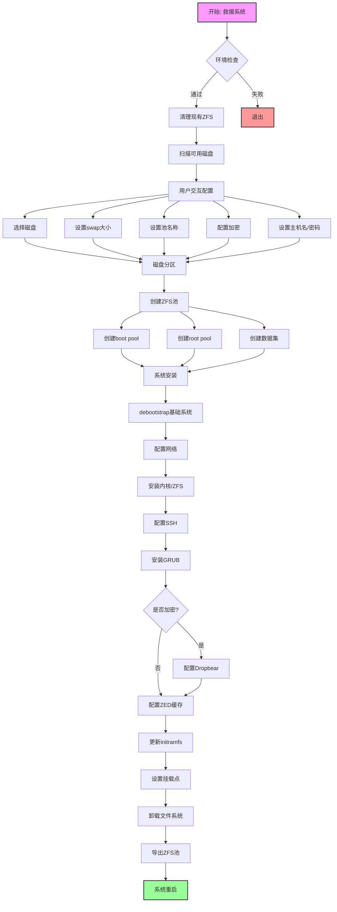
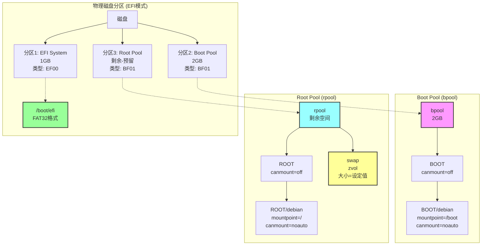
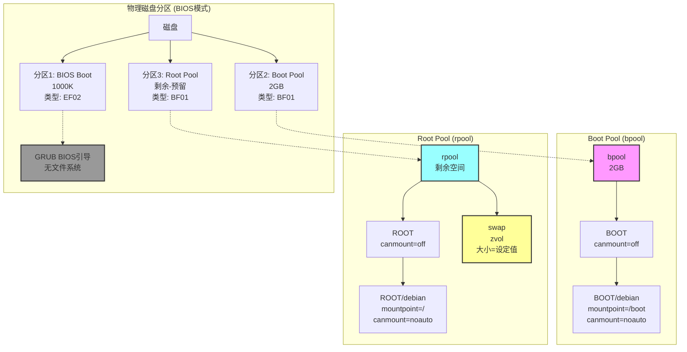

# Debian ZFS Setup Script 分析备忘

## 概述
这是一个用于在Hetzner VPS上全自动安装Debian 12 + ZFS root的脚本。脚本从救援系统启动，完成系统分区、ZFS池创建、系统安装和配置的全过程。

## 安装流程图



## ZFS池和数据集结构

### EFI模式分区结构



### BIOS模式分区结构



### EFI vs BIOS 分区差异对比

| 特性 | EFI模式 | BIOS模式 |
|------|---------|----------|
| **分区1大小** | 1GB | 1000K (约1MB) |
| **分区1类型** | EF00 (EFI System) | EF02 (BIOS Boot) |
| **分区1文件系统** | FAT32 | 无（GRUB引导代码） |
| **分区1挂载点** | /boot/efi | 无挂载点 |
| **GRUB安装方式** | grub-efi-amd64 | grub-pc |
| **引导器位置** | EFI分区 | MBR + BIOS Boot分区 |
| **多系统支持** | 原生支持 | 需要chainloader |

### ZFS池通用结构说明

无论是EFI还是BIOS模式，ZFS池的结构都是相同的：

- **Boot Pool (bpool)**
  - 大小：2GB
  - 兼容性：grub2（确保GRUB能读取）
  - 数据集：BOOT/debian
  - 挂载点：/boot

- **Root Pool (rpool)**
  - 大小：剩余空间减去预留
  - 可选加密：AES-256-GCM
  - 数据集：ROOT/debian
  - 挂载点：/
  - Swap：可选的zvol

## 脚本元信息
- 作者：Andrey Prokopenko (job@terem.fr), Cong Zhang, and other contributors
- 目标系统：Debian 12 (bookworm), Debian 13 (trixie)
- 适用环境：任何Debian支持的硬件平台
- 前提条件：救援系统需要添加SSH密钥

## 变量定义

### 用户配置变量
```bash
v_bpool_name=              # boot pool名称
v_rpool_name=              # root pool名称
v_selected_disks=()        # 选中的磁盘数组
v_swap_size=               # swap大小(GB)
v_free_tail_space=         # 磁盘末尾预留空间(GB)
v_hostname=                # 主机名
v_kernel_variant=          # 内核变体(如-cloud)
v_zfs_arc_max_mb=          # ZFS ARC缓存最大值(MB)
v_root_password=           # root密码
v_encrypt_rpool=           # 是否加密root pool (0/1)
v_passphrase=              # 加密密码
v_zfs_experimental=        # 是否使用实验性ZFS构建
```

### 常量定义
```bash
c_default_zfs_arc_max_mb   # 根据内存计算的默认ARC大小
c_default_swap_size_gb     # 默认swap大小(2倍内存)
c_default_bpool_tweaks     # boot pool默认参数
c_default_rpool_tweaks     # root pool默认参数
c_default_hostname=terem   # 默认主机名
c_zfs_mount_dir=/mnt       # ZFS挂载目录
c_debian_version=bookworm  # Debian版本
c_deb_packages_repo        # Debian软件源
c_deb_security_repo        # Debian安全更新源
```

## 主要函数分析

### 1. 系统准备阶段

#### check_prerequisites()
- 检查是否以root运行
- 检查SSH公钥是否存在
- 安装dialog工具

#### find_suitable_disks()
- 扫描系统中的磁盘
- 过滤掉已挂载的设备、光驱和可移动设备
- 生成可用磁盘列表

#### install_host_zfs()
- 在救援系统上安装ZFS
- 配置APT源
- 处理许可证确认
- 验证ZFS版本兼容性

### 2. 用户交互阶段

#### select_disks()
- 使用dialog让用户选择要使用的磁盘
- 支持多磁盘选择（镜像或条带）

#### ask_* 系列函数
- ask_swap_size: 询问swap大小
- ask_free_tail_space: 询问磁盘末尾预留空间
- ask_pool_names: 设置pool名称
- ask_pool_tweaks: 设置pool参数
- ask_encryption: 是否加密及密码设置
- ask_hostname: 设置主机名
- ask_root_password: 设置root密码
- ask_zfs_arc_max_size: 设置ARC缓存大小

### 3. 磁盘分区阶段

分区方案：
- 分区1：EFI/BIOS引导分区 (EFI: 1GB, BIOS: 1000K)
- 分区2：Boot pool (2GB)
- 分区3：Root pool (剩余空间)

### 4. ZFS池创建阶段

#### Boot Pool创建
```bash
zpool create \
  -o cachefile=/etc/zpool.cache \
  -o compatibility=grub2 \
  -O mountpoint=/boot -R $c_zfs_mount_dir -f \
  $v_bpool_name $pools_mirror_option "${bpool_disks_partitions[@]}"
```

#### Root Pool创建
- 支持加密选项
- 创建必要的数据集结构
- 设置挂载点

### 5. 系统安装阶段

#### debootstrap安装
- 使用debootstrap安装基础系统
- 配置网络（支持IPv4 DHCP和IPv6）
- 设置主机名和hosts文件

#### 系统配置
- 配置APT源
- 设置locale和时区
- 安装内核和ZFS包
- 配置SSH（禁用密码认证）
- 安装GRUB引导器

### 6. 特殊功能

#### ZFS加密支持
- 使用aes-256-gcm加密算法
- 配置dropbear用于远程解锁

#### 网络配置
- 使用systemd-networkd
- 自动配置IPv6地址
- 处理Hetzner特定的网络配置

#### ZED缓存初始化
- 初始化ZFS Event Daemon缓存
- 确保系统启动时正确挂载ZFS

## 执行流程

1. **环境检查**
   - 检查权限、SSH密钥
   - 清理现有ZFS状态

2. **磁盘准备**
   - 扫描可用磁盘
   - 用户选择磁盘
   - 创建分区

3. **ZFS配置**
   - 创建boot pool和root pool
   - 创建必要的数据集
   - 设置加密（可选）

4. **系统安装**
   - debootstrap安装基础系统
   - chroot环境配置
   - 安装必要软件包

5. **引导配置**
   - 安装配置GRUB
   - 更新initramfs
   - 设置ZFS缓存

6. **完成重启**
   - 卸载文件系统
   - 导出ZFS池
   - 系统重启

## 关键技术点

### 1. ZFS版本兼容性
- 救援系统和目标系统的ZFS版本需要兼容
- 最低要求Debian 12 (bookworm)

### 2. 分区对齐
- 使用sgdisk的-a1选项确保分区对齐
- ashift=12用于4K扇区优化

### 3. GRUB兼容性
- boot pool使用compatibility=grub2选项
- 确保GRUB能够读取ZFS

### 4. 加密实现
- 使用ZFS原生加密
- dropbear支持远程解锁

### 5. 网络配置
- 处理Hetzner的特殊网络配置
- initramfs中的静态路由钩子

## 注意事项

1. **数据安全**：脚本会清除磁盘上的所有数据
2. **网络稳定性**：建议在screen会话中运行
3. **硬件兼容性**：需要支持KVM虚拟化
4. **内存要求**：根据内存自动调整ARC缓存大小

## 可定制项

1. **Debian版本**：通过DEBIAN_VERSION环境变量
2. **软件源**：通过DEB_PACKAGES_REPO环境变量
3. **ZFS参数**：通过交互式配置调整
4. **实验性ZFS**：支持使用第三方ZFS仓库

## 扩展性

脚本设计考虑了扩展性：
- 可适配其他云服务商
- 支持不同的Debian版本
- 模块化的函数设计便于修改

## 关键函数实现细节

### 1. 磁盘扫描和识别 (find_suitable_disks)

```bash
# 使用by-path确保支持所有磁盘类型
candidate_real_devices=$(find /dev/disk/by-path -type l -not -regex '.+-part[0-9]+$' | xargs -I {} readlink -f {} | sort | uniq)

# 过滤条件：
# - 不是CD-ROM (ID_TYPE=cd)
# - 没有被挂载
# - 获取真实设备路径去重
```

### 2. ZFS ARC缓存计算逻辑

```bash
c_default_zfs_arc_max_mb=$(
  total_mem_mb=$(free -m | awk 'NR==2{print $2}' 2>/dev/null || echo 1024)
  if [[ $total_mem_mb -le 1024 ]]; then
    echo 256      # ≤1GB内存：256MB
  elif [[ $total_mem_mb -le 2048 ]]; then
    echo 512      # ≤2GB内存：512MB
  else
    echo $((total_mem_mb / 4))  # >2GB内存：25%
  fi
)
```

### 3. 分区UUID处理

脚本使用PARTUUID而不是设备名，提高了可靠性：
```bash
# 获取分区UUID
rpool_partuuid=$(lsblk -no PARTUUID "${selected_disk}3" 2>/dev/null | tr -d '\n ')
# 使用UUID路径
rpool_disks_partitions+=("/dev/disk/by-partuuid/$rpool_partuuid")
```

### 4. ZED缓存初始化 (initial_load_debian_zed_cache)

这是一个关键函数，确保ZFS能正确启动：
- 创建缓存目录和文件
- 启动ZED守护进程
- 等待缓存更新（最多120秒）
- 修正缓存中的路径

### 5. Dropbear配置（加密解锁）

为加密的root pool配置远程解锁：
- 复制SSH公钥到initramfs
- 转换OpenSSH密钥格式为Dropbear格式
- 支持RSA和ECDSA密钥

### 6. 网络配置特殊处理

#### systemd-networkd配置
```ini
[Match]
Name=eth0

[Network]
DHCP=ipv4
Address=${ip6addr_prefix}:1/64
Gateway=fe80::1
```

#### initramfs静态路由钩子
处理某些环境下的DHCP问题，特别是Hetzner的网络配置

## 错误处理和恢复机制

### 1. 严格的错误处理
```bash
set -o errexit    # 遇错即止
set -o pipefail   # 管道命令错误传播
set -o nounset    # 未定义变量报错
```

### 2. 清理机制
- 开始前清理现有ZFS状态
- 强制卸载和导出池
- 清除ZFS标签

### 3. 重试机制
- ZFS池导出重试（最多60秒）
- ZED缓存等待（最多120秒）
- 虚拟文件系统卸载等待

## 安全考虑

1. **SSH配置**
   - 禁用密码认证
   - 仅允许公钥认证
   - 重新生成主机密钥

2. **加密选项**
   - AES-256-GCM加密
   - 密码长度最少8位
   - 支持远程解锁

3. **权限管理**
   - 临时目录设置1777权限
   - root用户umask 022

## 性能优化

1. **ZFS参数优化**
   - ashift=12 (4K对齐)
   - compression=lz4 (平衡性能)
   - relatime=on (减少写入)
   - dnodesize=auto
   - xattr=sa (性能优化)

2. **Swap配置**
   - 使用zvol作为swap
   - 优化参数：logbias=throughput
   - sync=always确保数据安全

3. **内存管理**
   - 动态ARC缓存大小
   - 根据系统内存自动调整

## 兼容性处理

1. **EFI/BIOS双支持**
   - 自动检测启动模式
   - 不同的分区方案
   - 相应的GRUB配置

2. **磁盘类型支持**
   - virtio (/dev/vd*)
   - SCSI (/dev/sd*)
   - NVMe (/dev/nvme*)

3. **内核变体检测**
   - 自动检测虚拟化环境
   - 选择合适的内核包（如-cloud）

## 故障排除

### 常见问题

1. **ZFS版本不兼容**
   - 问题：救援系统ZFS版本过旧
   - 解决：确保救援系统是Debian 12或更新版本

2. **分区未创建成功**
   - 问题：分区创建后设备节点不存在
   - 脚本已包含：udevadm settle和sleep等待
   - 可增加等待时间或使用partprobe

3. **ZED缓存初始化失败**
   - 问题：ZED守护进程未能更新缓存
   - 脚本已包含：120秒超时等待
   - 检查ZFS服务状态

4. **网络配置问题**
   - 问题：某些VPS的特殊网络配置
   - 脚本处理：initramfs静态路由钩子
   - 可能需要根据具体环境调整

### 调试技巧

1. **启用调试模式**
   ```bash
   DEBUG=1 ./debian-zfs-setup.sh
   ```

2. **查看日志文件**
   - 安装日志：/tmp/zfs-hetzner-vm/install.log
   - 磁盘信息：/tmp/zfs-hetzner-vm/disks.log
   - 系统信息：/tmp/zfs-hetzner-vm/lsb_release.log

3. **在screen中运行**
   ```bash
   screen -dmS zfs
   screen -r zfs
   # Ctrl-a d 分离会话
   ```

## 实际使用建议

### 1. 准备工作
- 确保有可用的救援系统访问
- 备份重要数据（脚本会清除所有数据）
- 添加SSH公钥到救援系统
- 记录网络配置信息

### 2. 参数选择建议

#### 内存与ARC缓存
- 1GB内存：256MB ARC
- 2GB内存：512MB ARC
- 4GB+内存：25% ARC
- 可根据实际负载调整

#### Swap大小
- 默认2倍内存大小
- SSD环境可适当减少
- 内存充足时可设为0

#### 池参数优化
- SSD：保持默认ashift=12
- 高IOPS需求：compression=lz4
- 存储优先：compression=zstd
- 数据库负载：recordsize调整

### 3. 安全建议
- 生产环境启用加密
- 定期更新系统和ZFS
- 配置防火墙规则
- 禁用不必要的服务

### 4. 维护建议

#### 定期检查
```bash
# 池状态
zpool status
# 数据集使用情况
zfs list
# ARC缓存统计
arc_summary
```

#### 性能监控
```bash
# IO统计
zpool iostat -v 5
# ARC命中率
arcstat 1
```

## 自定义修改指南

### 1. 适配其他VPS提供商
- 修改网络配置部分
- 调整initramfs钩子
- 测试特定硬件兼容性

### 2. 更改Debian版本
```bash
export DEBIAN_VERSION=trixie  # Debian 13
./debian-zfs-setup.sh
```

### 3. 使用自定义镜像源
```bash
export DEB_PACKAGES_REPO=http://mirrors.163.com/debian
export DEB_SECURITY_REPO=http://mirrors.163.com/debian-security
./debian-zfs-setup.sh
```

### 4. 修改默认配置
编辑脚本中的常量定义：
- c_default_hostname
- c_default_*_tweaks
- 分区大小

## 脚本限制

1. **仅支持全盘安装**
   - 不支持双系统
   - 会清除所有现有数据

2. **硬件要求**
   - 需要KVM虚拟化支持
   - 最低1GB内存建议

3. **网络要求**
   - 需要稳定的网络连接
   - 某些环境可能需要代理

4. **不支持的功能**
   - ZFS根目录快照回滚启动
   - 复杂的存储布局
   - 自定义分区方案

## 总结

这个脚本是一个功能完整、考虑周全的自动化部署工具。主要优势：

1. **高度自动化**：最小化人工干预
2. **错误处理完善**：包含重试和恢复机制
3. **安全性考虑**：支持加密和安全配置
4. **灵活可扩展**：模块化设计便于修改

适用场景：
- VPS快速部署
- ZFS测试环境
- 需要加密的系统
- 自动化运维

需要注意的是，使用前务必理解脚本的工作原理，特别是在生产环境中使用时。
