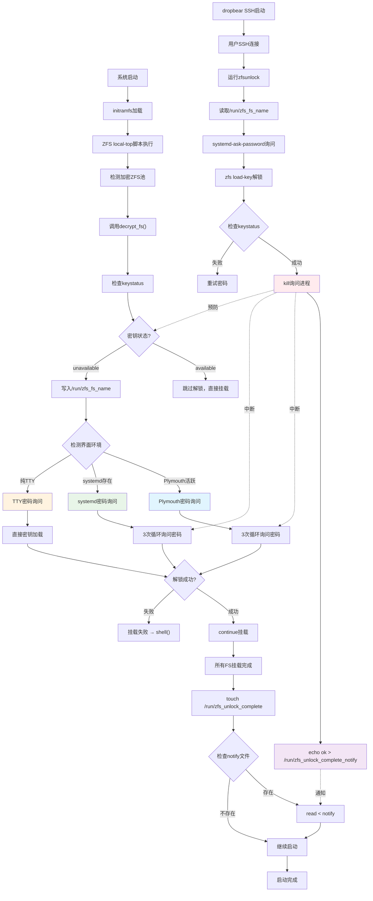

# ZFS initramfs 启动机制深度分析

> 技术笔记 - ZFS加密池启动、解锁机制及与initramfs的集成
> 
> 日期：2024年12月20日

## 目录

1. [initramfs 合成机制](#initramfs-合成机制)
2. [LVM vs ZFS 支持方式对比](#lvm-vs-zfs-支持方式对比)
3. [ZFS 启动完整流程](#zfs-启动完整流程)
4. [多种解锁方式协作机制](#多种解锁方式协作机制)
5. [技术实现细节](#技术实现细节)
6. [关键发现与洞察](#关键发现与洞察)

---

## initramfs 合成机制

### 基本概念

`initramfs` (Initial RAM File System) 是Linux启动过程中的临时根文件系统，包含启动早期需要的工具、驱动和脚本。

### initramfs-tools 目录结构

```
/usr/share/initramfs-tools/
├── hooks/           # 构建阶段：准备工具和脚本
├── scripts/         # 运行阶段：实际执行的脚本
│   ├── init-top/    # 最早执行
│   ├── init-premount/
│   ├── local-top/   # 本地存储处理
│   ├── local-premount/
│   ├── local-bottom/
│   └── init-bottom/ # 最后执行
├── conf.d/          # 配置文件
├── conf-hooks.d/    # hooks配置
└── modules.d/       # 内核模块
```

### hooks vs scripts 的关系

| 阶段 | hooks/ 目录 | scripts/ 目录 |
|------|-------------|---------------|
| **时机** | initramfs **构建时** | initramfs **运行时** |
| **作用** | 准备环境（复制文件、工具） | 执行启动逻辑 |
| **举例** | `hooks/lvm2` → 复制lvm命令 | `scripts/local-top/zfs` → 导入ZFS池 |

#### 典型工作流：

```bash
# 构建阶段
mkinitramfs → 执行 hooks/lvm2 → copy_exec /usr/sbin/lvm
           → 执行 hooks/zfs   → copy_exec /sbin/zfs

# 运行阶段  
initramfs启动 → scripts/local-top/zfs → /sbin/zfs import rpool
```

---

## LVM vs ZFS 支持方式对比

### 根本差异：原生 vs 扩展

| 特性 | LVM | ZFS |
|------|-----|-----|
| **支持方式** | 原生集成 | 扩展包提供 |
| **检测机制** | 读取 `/etc/crypttab` | 无条件复制工具 |
| **用户提示** | 智能MOTD提示 | 无提示（设计缺陷） |
| **许可证** | GPL兼容 | CDDL冲突 |

### LVM的智能设计

```bash
# hooks/cryptroot-unlock 会检测：
if [ ! -f "$DESTDIR/lib/cryptsetup/askpass" ]; then
    exit 0  # 没有加密，不添加提示
fi

# 有加密才添加MOTD：
cat >>"$DESTDIR/etc/motd" <<- EOF
    To unlock root partition, and maybe others like swap, run \`cryptroot-unlock\`.
EOF
```

### ZFS的简陋设计

```bash
# hooks/zfsunlock 无脑复制：
copy_exec /usr/share/initramfs-tools/zfsunlock /usr/bin/zfsunlock
# 无检测、无条件、无提示
```

### 设计哲学差异

- **LVM/cryptsetup**: 面向普通用户，注重体验
- **ZFS**: 起源企业级，假设专业知识

---

## ZFS 启动完整流程

### 阶段划分



### 关键代码分析

#### 1. 密钥状态检查（预防性保护）

```bash
# /usr/share/initramfs-tools/scripts/zfs decrypt_fs()
KEYSTATUS="$(get_fs_value "${ENCRYPTIONROOT}" keystatus)"
[ "$KEYSTATUS" = "unavailable" ] || return 0  # 已解锁就跳过
```

#### 2. 环境检测与密码询问

```bash
# Plymouth环境（图形界面）
if /bin/plymouth --ping 2>/dev/null; then
    echo "plymouth" > /run/zfs_console_askpwd_cmd
    for _ in 1 2 3; do
        plymouth ask-for-password --prompt "Encrypted ZFS password for ${ENCRYPTIONROOT}" | \
            $ZFS load-key "${ENCRYPTIONROOT}" && break
    done

# systemd环境  
elif [ -e /run/systemd/system ]; then
    echo "systemd-ask-password" > /run/zfs_console_askpwd_cmd
    for _ in 1 2 3; do
        systemd-ask-password --no-tty "Encrypted ZFS password for ${ENCRYPTIONROOT}" | \
            $ZFS load-key "${ENCRYPTIONROOT}" && break
    done

# 纯TTY环境
else
    echo "load-key" > /run/zfs_console_askpwd_cmd
    $ZFS load-key "${ENCRYPTIONROOT}"
fi
```

#### 3. 挂载失败处理

```bash
# mount_fs() 函数
ZFS_STDERR=$(${ZFS_CMD} "${fs}" "${rootmnt}/${mountpoint}" 2>&1)
ZFS_ERROR=$?
if [ "${ZFS_ERROR}" != 0 ]; then
    echo "Failed to mount ${fs} on ${rootmnt}/${mountpoint}."
    echo "Manually mount the filesystem and exit."
    shell  # 进入交互Shell，不是无限等待！
fi
```

---

## 多种解锁方式协作机制

### 通信文件系统

ZFS启动使用 `/run/` 目录下的文件进行进程间通信：

```bash
/run/zfs_fs_name                    # 当前需要解锁的文件系统名
/run/zfs_console_askpwd_cmd        # 当前密码询问命令类型
/run/zfs_unlock_complete           # 所有挂载完成标记
/run/zfs_unlock_complete_notify    # 解锁完成通知管道（FIFO）
```

### SSH解锁的中断机制

#### 1. 主动进程终止

```bash
# zfsunlock 脚本关键代码
if [ "$(/sbin/zfs get -H -ovalue keystatus "$zfs_fs_name" 2> /dev/null)" = "available" ]; then
    echo "Password for $zfs_fs_name accepted."
    
    # 查找并杀死正在询问密码的进程
    zfs_console_askpwd_pid=$(ps | awk '!'"/awk/ && /$zfs_console_askpwd_cmd/ { print \$1; exit }")
    if [ -n "$zfs_console_askpwd_pid" ]; then
        kill "$zfs_console_askpwd_pid"  # 关键：主动中断
    fi
fi
```

#### 2. 时序保护机制

无论SSH解锁在何时完成，都能正确处理：

- **解锁在密码询问前**：decrypt_fs() 开头检查keystatus，直接跳过
- **解锁在密码询问中**：kill掉询问进程，for循环继续但密钥已可用
- **解锁在挂载完成后**：通过notify文件通知启动脚本继续

### Plymouth的作用

**Plymouth** = 图形化启动管理器

- **美化界面**：替代黑屏文本滚动，提供主题化启动画面
- **密码输入**：`plymouth ask-for-password` 显示图形密码框
- **进程管理**：可被kill命令中断，支持SSH协作

---

## 技术实现细节

### 纯脚本架构的优势

整个ZFS initramfs支持都是Shell脚本实现：

**优点**：
- ✅ 易于调试和修改
- ✅ 跨架构兼容（ARM、x86等）
- ✅ 启动环境资源消耗小
- ✅ 社区维护简单

**缺点**：
- ❌ 执行效率略低
- ❌ 依赖shell环境

### Unix哲学体现

- **小工具组合**：每个脚本专注一件事
- **文件通信**：通过 `/run/` 目录交换信息
- **简单可预测**：纯文本文件，cat/echo读写

### 错误处理策略

ZFS initramfs采用"优雅降级"策略：

1. **自动解锁失败** → 尝试手动询问密码
2. **手动解锁失败** → 进入交互Shell（不是死锁）
3. **SSH远程解锁** → 通过进程管理协作

---

## 关键发现与洞察

### 1. "等待"的真相

❌ **常见误解**：启动程序会无限等待用户输入
✅ **实际机制**：失败时进入交互Shell，用户可以手动操作

### 2. SSH解锁的本质

❌ **常见误解**：SSH是"中断"机制
✅ **实际机制**：SSH是"协作"机制，通过进程管理和文件通信

### 3. 设计差异的根源

| 方面 | LVM/cryptsetup | ZFS |
|------|----------------|-----|
| **目标用户** | 普通用户 | 企业管理员 |
| **设计理念** | 友好体验 | 功能优先 |
| **法律限制** | 无 | GPL/CDDL冲突 |
| **社区支持** | 原生集成 | 第三方包 |

### 4. 最佳实践建议

#### 对于ZFS用户：

1. **改进MOTD提示**：
   ```bash
   # 在 hooks/zfsunlock 中添加：
   cat >>"$DESTDIR/etc/motd" <<- EOF
       To unlock ZFS encrypted filesystems, run \`zfsunlock\`.
   EOF
   ```

2. **配置SSH解锁**：
   - 安装 `dropbear-initramfs`
   - 配置SSH密钥认证
   - 测试 `zfsunlock` 命令

3. **理解机制**：
   - 控制台失败会进入Shell，不是死锁
   - SSH解锁通过进程管理协作
   - 多种方式可以并行工作

### 5. 架构优势

这个设计的优秀之处：

- **容错性强**：多种方式都失败也有Shell兜底
- **并发安全**：时序保护和进程管理确保协作
- **扩展性好**：纯脚本，易于定制和调试
- **体验友好**：支持图形界面（Plymouth）和远程管理（SSH）

---

## 结论

ZFS initramfs启动机制是一个精心设计的系统，通过以下方式实现了复杂的启动解锁协作：

1. **分层架构**：hooks准备，scripts执行
2. **多路并发**：控制台、SSH可同时工作
3. **进程协作**：通过文件通信和进程管理
4. **优雅降级**：失败时提供交互Shell而非死锁

虽然在用户体验上不如LVM/cryptsetup完善，但在功能性和可靠性上表现出色。理解这些机制有助于更好地管理和调试ZFS加密系统。

---

*本笔记基于 Debian 13 (trixie) 系统上的 zfs-initramfs 2.3.2-2 版本分析*
